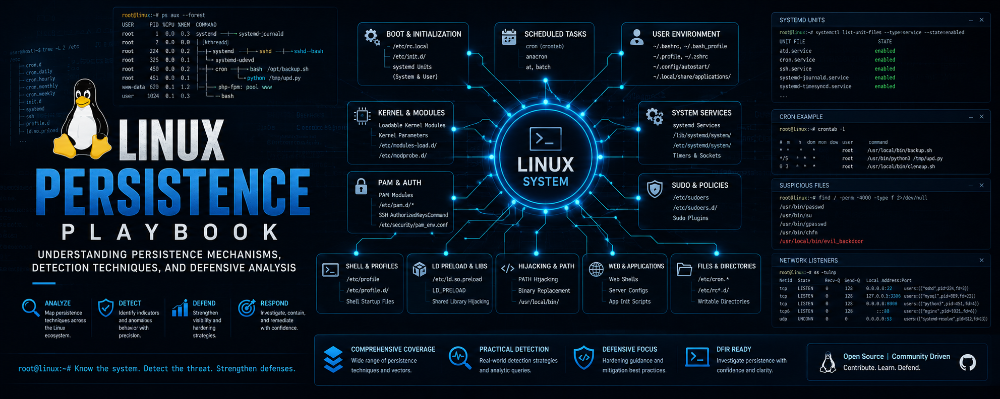

# Linux Persistence Playbook

## Overview

This repository documents the most common Linux persistence techniques used in red team operations, adversary emulation exercises, malware analysis, and DFIR investigations.

The goal is to understand how attackers maintain access to Linux systems after initial compromise, how these mechanisms operate, where artifacts are stored, and how investigators can identify them during incident response.

---

## 🎯 Covered Techniques

This project focuses on the **Top persistence methods** commonly observed in Linux environments:

1. [Cron Jobs](01-cron-jobs-persistence.md)
2. [Systemd Services](02-systemd-service-persistence.md)
3. [Shell Startup Files](03-shell-startup-files-persistence.md)
4. [Web Shell Persistence](04-web-shell-persistence.md)
5. [SUID Backdoors & Privilege Persistence](05-suid-backdoors-and-privilege-persistence.md)
6. [SSH Authorized Keys Persistence](06-ssh-authorized-keys-persistence.md)
